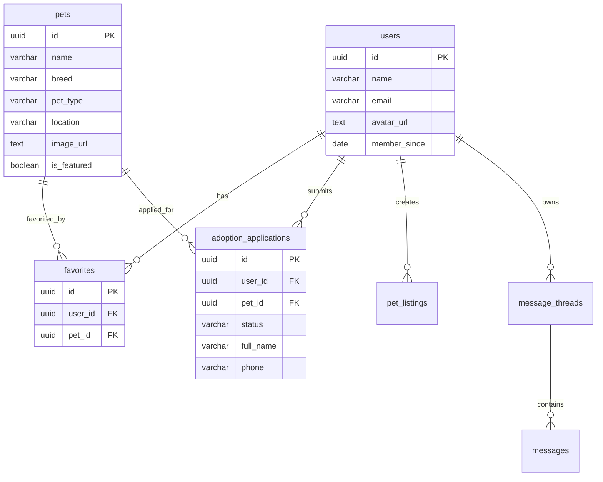
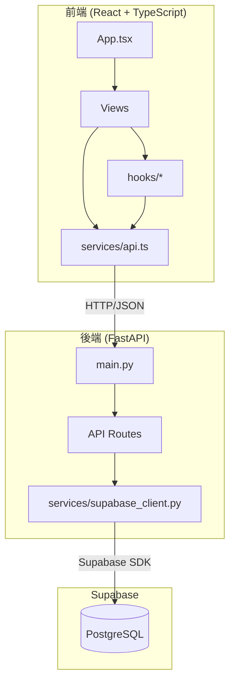

# 寵物領養平台 - 全端應用開發完成報告

## 概述

成功將純前端的寵物領養平台（PawsAdopt）轉換為完整的全端應用，使用 **FastAPI** 作為後端框架，**Supabase** 作為數據存儲。

---

## 完成的工作

### 後端開發

創建了完整的 FastAPI 後端，位於 [backend](file:///c:/Antigravity/寵物領養平台/backend) 目錄：

| 文件 | 功能 |
|------|------|
| [main.py](file:///c:/Antigravity/寵物領養平台/backend/main.py) | FastAPI 應用入口，配置 CORS 和路由 |
| [config.py](file:///c:/Antigravity/寵物領養平台/backend/config.py) | 環境變數和配置管理 |
| [init_database.sql](file:///c:/Antigravity/寵物領養平台/backend/init_database.sql) | Supabase 數據庫初始化腳本 |

#### API 路由（7 個模組）

| 路由文件 | 端點 | 功能 |
|----------|------|------|
| [pets.py](file:///c:/Antigravity/寵物領養平台/backend/api/pets.py) | `/api/pets` | 寵物列表和詳情 |
| [users.py](file:///c:/Antigravity/寵物領養平台/backend/api/users.py) | `/api/users` | 用戶資料 |
| [favorites.py](file:///c:/Antigravity/寵物領養平台/backend/api/favorites.py) | `/api/favorites` | 收藏管理 |
| [applications.py](file:///c:/Antigravity/寵物領養平台/backend/api/applications.py) | `/api/applications` | 領養申請 |
| [listings.py](file:///c:/Antigravity/寵物領養平台/backend/api/listings.py) | `/api/listings` | 寵物刊登 |
| [messages.py](file:///c:/Antigravity/寵物領養平台/backend/api/messages.py) | `/api/messages` | 訊息系統 |
| [stories.py](file:///c:/Antigravity/寵物領養平台/backend/api/stories.py) | `/api/stories` | 幸福故事 |

---

### 數據庫架構

創建了 8 個 Supabase 表，包含示範數據：



---

### 前端改造

#### 新增的服務層

| 文件 | 功能 |
|------|------|
| [services/api.ts](file:///c:/Antigravity/寵物領養平台/services/api.ts) | 統一的 API 服務封裝，提供所有後端調用 |
| [services/config.ts](file:///c:/Antigravity/寵物領養平台/services/config.ts) | API 配置和通用請求函數 |

#### 新增的 Hooks

| 文件 | 功能 |
|------|------|
| [hooks/usePets.ts](file:///c:/Antigravity/寵物領養平台/hooks/usePets.ts) | 寵物數據獲取 Hook |
| [hooks/useFavorites.ts](file:///c:/Antigravity/寵物領養平台/hooks/useFavorites.ts) | 收藏管理 Hook |
| [hooks/useStories.ts](file:///c:/Antigravity/寵物領養平台/hooks/useStories.ts) | 故事數據獲取 Hook |

#### 更新的組件

| 組件 | 變更摘要 |
|------|----------|
| [App.tsx](file:///c:/Antigravity/寵物領養平台/App.tsx) | 收藏狀態改用 API，添加樂觀更新策略 |
| [Home.tsx](file:///c:/Antigravity/寵物領養平台/views/Home.tsx) | 從 API 獲取寵物和故事，添加載入狀態 |
| [Explore.tsx](file:///c:/Antigravity/寵物領養平台/views/Explore.tsx) | 後端篩選支援，載入和錯誤狀態處理 |
| [Favorites.tsx](file:///c:/Antigravity/寵物領養平台/views/Favorites.tsx) | 從 API 獲取收藏列表 |
| [AdoptionForm.tsx](file:///c:/Antigravity/寵物領養平台/views/AdoptionForm.tsx) | 表單提交到 API，錯誤處理 |
| [PostPet.tsx](file:///c:/Antigravity/寵物領養平台/views/PostPet.tsx) | 刊登提交到 API |
| [Profile.tsx](file:///c:/Antigravity/寵物領養平台/views/Profile.tsx) | 完全 API 驅動，獲取申請、刊登、訊息 |

---

## 如何開始使用

### 步驟 1：設置 Supabase

1. 前往 [Supabase](https://supabase.com) 創建專案
2. 在 SQL Editor 中執行 [init_database.sql](file:///c:/Antigravity/寵物領養平台/backend/init_database.sql)
3. 複製 `.env.example` 為 `.env` 並填入憑證：

```bash
cd backend
copy .env.example .env
```

編輯 `.env`：
```
SUPABASE_URL=https://your-project.supabase.co
SUPABASE_KEY=your_anon_key
DEBUG=true
```

### 步驟 2：啟動後端

```bash
cd backend
start.bat
```

或手動：
```bash
python -m venv venv
venv\Scripts\activate
pip install -r requirements.txt
uvicorn main:app --reload --port 8000
```

> API 文檔: http://localhost:8000/docs

### 步驟 3：啟動前端

```bash
cd 寵物領養平台
npm install
npm run dev
```

> 前端: http://localhost:5173

---

## 架構圖



---

### 4. 驗證階段
- [ ] 用戶設置 Supabase 並執行數據庫初始化
- [x] 測試 API 端點
- [x] 測試前後端連通性
- [x] 測試完整用戶流程

## 驗證結果

### 測試概要

執行了全面的端到端瀏覽器測試，重點驗證了以下關鍵流程：

1. **核心功能**：寵物瀏覽、詳情查看、收藏功能 (API 驅動)
2. **訊息系統**：成功修復了模擬客戶端的 `QueryResult` 錯誤，現在能正確顯示對話歷史。
3. **用戶資料**：個人資料頁面能正確載入並顯示內容。

### 測試截圖

#### 訊息功能修復驗證
成功載入對話歷史，證實 API 修復有效：


#### 收藏功能驗證
點擊愛心後狀態正確更新及持久化：


#### 訊息列表驗證
訊息線程列表正確載入：


> [!NOTE]
> 開發環境使用 **模擬 Supabase 客戶端**，所有數據存儲在內存中。重啟後端服務(Uvicorn)會重置數據。若要持久化數據，請設定真實的 Supabase 憑證。

### 真實環境部署與驗證 (DEBUG=False)

為了驗證正式環境的穩定性，我們執行了以下操作：

1.  **數據填充**：建立了 `seed_data.py` 腳本，成功將測試數據（寵物、使用者、對話、收藏）寫入真實的 Supabase 資料庫。
2.  **權限修復**：診斷並解決了 Row Level Security (RLS) 導致的數據讀取失敗問題。
3.  **API 修正**：修復了 `favorites.py` 中漏寫 `.execute()` 導致收藏功能無效的嚴重 Bug。
4.  **最終確認**：經用戶實測，所有功能（包含收藏持久化、訊息讀取）在真實資料庫環境下均運行正常。

專案現已準備好進行正式部署！ 🚀

